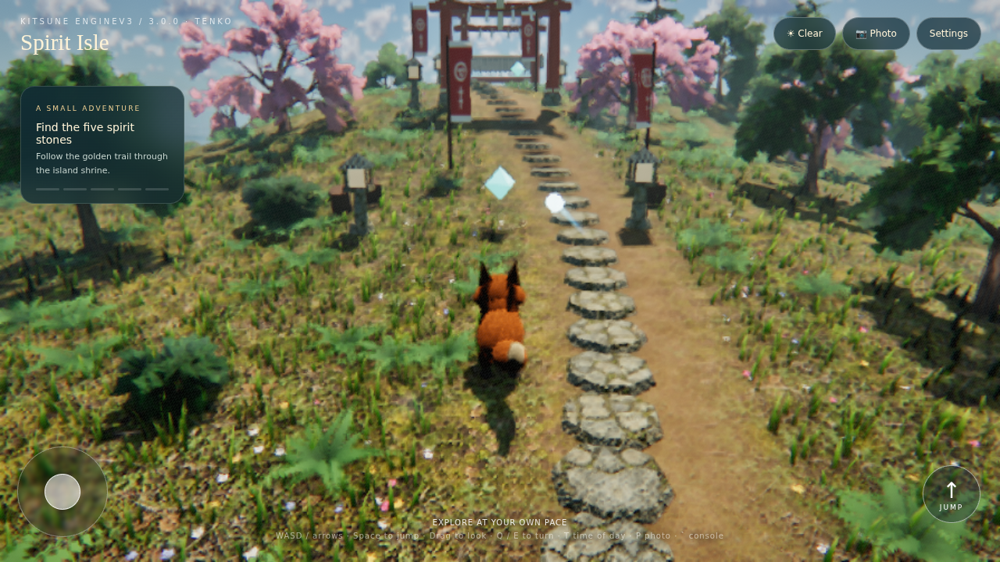
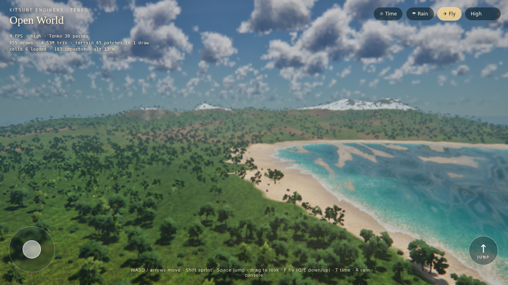

# kitsune enginev3 · Tenko

An offline browser game engine on Three.js r128 (WebGL2) that builds every game into a single HTML file. Version 3 adds an HDR render pipeline, a physical sky, cascaded shadows, probe GI, water and weather, procedural forests and fur, cluster LOD, open-world terrain streaming, Rapier physics, cloth, GPU particles, procedural animation, navmesh AI, spatial audio, a gameplay framework and an in-game editor. Two playable showcases use it.

| Spirit Isle | Open World |
|---|---|
|  |  |
| `spirit-isle.html`: find five spirit stones with a wisp as your guide; day and night, rain, photo mode, F8 editor | `open-world.html`: a 2 km Japanese island generated and eroded on load: a snow-capped volcano, a river down to the bay with boats you can board and steer (E), tall cedars, red maples, sakura, bamboo groves and a daisugi; fly mode |

Open either file in a desktop or mobile browser with WebGL2; no server, account or network request is needed. Low-power machines start on the Low preset; choose High or Ultra in Settings for the full renderer. Desktops with an RTX 3060/4060 Ti/5060 Ti or Radeon RX 6700-class card (or better) start on **Epic (PC)**: native resolution, 4096² shadows, full-detail trees, grass with shadows and the longest draw distances. Pick it by hand in the quality menu if your browser hides the GPU name. [START-HERE.html](START-HERE.html) has controls and more screenshots.

## What is inside

| Area | Systems (module) |
|---|---|
| Rendering | HDR pipeline with TAA upscaling and dynamic resolution, GTAO, SSGI, screen-space reflections, height and volumetric fog, light shafts, bloom, eye adaptation and local exposure, DOF, motion blur (`10-pipeline`) · physical sky and volumetric clouds (`12-sky`) · cascaded shadows with PCSS (`14-shadows`) · pooled point lights (`16-lights`) · probe-volume GI with DDGI-style visibility (`18-gi`) · Gerstner water and carved rivers (`22-water`) · rain wetness, puddles, snow (`26-weather`) |
| Content | JSON material graphs and a 14-material library (`20-materials`) · procedural trees (including Japanese cedar and maple), bamboo, daisugi, grass, shell fur, spawner (`24-foliage`) · simplification, LOD, impostors, Nanite-inspired cluster DAG (`30-geometry`) · eroded heightfields, CDLOD GPU terrain, World Partition (`32-world`) · the fox character (`62-characters`) · wooden boats (`22-water`) |
| Simulation | Rapier rigid bodies, joints, character controller, vehicle, fracture, buoyancy (`40-physics`) · position-based cloth (`42-cloth`) · GPU particles (`50-vfx`) |
| Behaviour | IK, spring chains, procedural gait, blend spaces, state machine, sequencer, camera rails (`60-animation`) · navmesh, crowds, behavior trees, perception, EQS (`70-ai`) · spatial audio, synthesized sounds, ambience, generative music (`80-audio`) |
| Tools | actors, components, JSON levels, Blueprints (`85-gameplay`) · F8 editor and backquote console with `stat unit` / `stat gpu` (`90-editor`) |

Each system is modelled on a UE5 feature; [engine-overview.md](source/references/engine-overview.md) maps them and lists what each one lacks. Nothing here claims equivalence with Unreal Engine 5.

## Build and test

```bash
python3 source/scripts/build_engine.py                                     # src/ + vendor/ -> source/assets/*.js
python3 source/scripts/build.py source/assets/starter.html spirit-isle.html  # a game -> one offline HTML file
python3 source/scripts/build.py source/examples/src/open-world.html open-world.html
node source/scripts/test_all.cjs                                           # every suite; writes verification.json
```

Browser suites run in headless Chromium with software WebGL2 (Playwright + SwiftShader). [verification.json](verification.json) records the latest full run, its environment and file hashes. Not verified: frame rates on real GPUs or phones, touch input on devices, audio on real speakers. On a real machine, open the console (backquote) and use `stat unit` and `stat gpu` to measure.

## Layout

- `source/src/core.js`, `source/src/modules/NN-name.js`: engine sources (one module per subsystem)
- `source/assets/`: built engine bundle, Three.js r128, add-ons, libraries (Rapier, meshoptimizer), the Spirit Isle starter
- `source/references/`: an API reference per system; start with `engine-overview.md`
- `source/scripts/`: builders, the browser test harness and one test per module
- `source/examples/src/`: showcase pages (open world, physics, VFX, animation, AI, audio, geometry, materials, editor)
- `kitsune-enginev3.skill`: the `source` folder packaged as a skill; `.claude/skills/run-kitsune-engine/`: a driver for building, playing and screenshotting the games headlessly

Three.js (MIT), meshoptimizer (MIT) and Rapier (Apache-2.0) notices are in [THIRD_PARTY_LICENSES.txt](source/assets/THIRD_PARTY_LICENSES.txt) and inside the built games.
